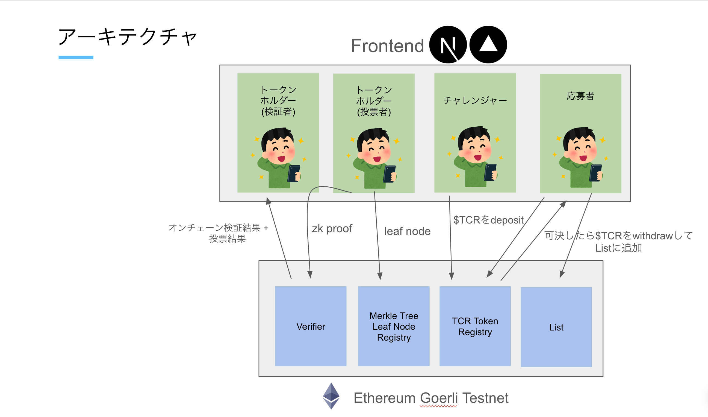

# zkTCR

## What it does

「zkTCR」は、zk 投票での Token Curated Registry による、より公正で透明性のあるデータベースです。<br>
TCR による経済的インセンティブの設計と zkp による匿名投票によって、ReFi におけるデータ基盤となることを目指します目指します

## The problem it solves

- リスト視聴者とリスト参加者はリストオーナーが正直に行動していると信じるしかない
- 中央集権的なリストは、自身の裁量でリストを更新することが可能
- 分散型リストでは、スパムや不正投票ができてしまう

## TCR とは

トークンホルダー・リストに追加したい人・リストユーザー 3 者がそれぞれの経済的インセンティブに従って動けば、高品質なリストを持つことが達成されるメカニズムデザイン。


### トークンホルダー

リスト応募者が自分のデータをリストに追加したいと望むような、人気のある高品質なリストを維持することがインセンティブ<br>
応募がリストに適していないと判断した場合、応募に異議を唱えることができる。異議申し立てには預金が必要。<br>
異議が申し立てられると、トークンホルダーは応募を受け入れるか拒否するかを投票で決定できる。<br>
異議が申し立てられると、トークンホルダーは応募を受け入れるか拒否するかを投票で決定できる。投票は、所有するトークンの数に比例。<br>
応募が拒否された場合、預金は没収される。応募者の預金は、異議を唱えたチャレンジャーと拒否に投票したトークンホルダーの間で分割される。<br>
応募が受け入れられた場合、データはリストに追加され、応募者は預金を保持。チャレンジャーの預金は没収され、応募者と受け入れに投票したトークンホルダーの間で分割される。<br>

### リスト応募者

ネイティブトークンを購入し、申請の預金を行う<br>
リストが高品質であるとユーザーが使用しているから載せたい

### ユーザー

リストの品質が高くなればなるほど、より多くのユーザーがリストを見ることになる

## Technologies I used

- Ethereum ... ブロックチェーン
- Circuit ... zk 回路
- Next.js ... フロントエンド

## Architecture



クライアントサイドで zk proof を生成し、オンチェーンで検証

## Development

View [`Makefile.toml`](./Makefile.toml)

## Contract Address

Ethereum Goerli Testnet

```bash
Poseidon hash lib deployed in address: 0x52E5A7Fd58F6226938A0272299C6a24e16a32F55
incrementalBinaryTreeLib deployed in address: 0x87aAAC27309Ed77724390F57F313a9036ce4e581
Verifier contract deployed in address: 0x5E368aff78e3F01A83b4fD069cDbD8bBb16D3F04
Owner: 0x6b07154C8e768673578e539854C70a8703D613b1
Contract address:0xBd8b0BDe561E8bBa934F2eB6B03d7C5A5bbD478a
```

```bash
escrowAddress = "0xa30401ddcdC5Db655B14F0a4Cd3eA99ce90fF1a7";
tokenAddress = "0x17806e4b0a1b430948F1013414915B2E452821A3";
```

## Member

- **wasabi**: https://github.com/wasabijiro
- **konaito**: https://github.com/konaito
